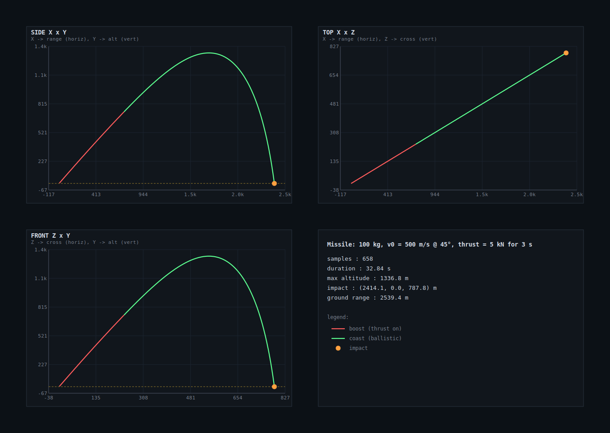
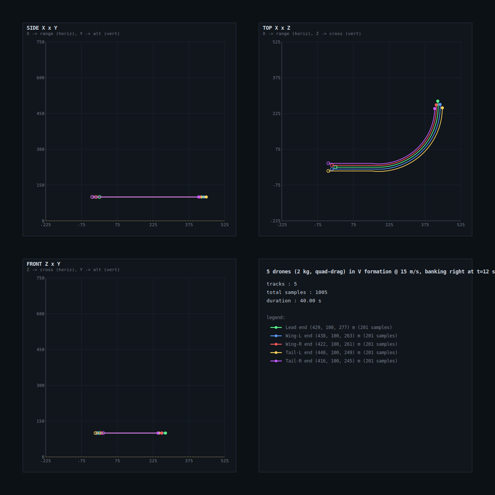

# physics_sandbox

A small, dependency-free rigid-body physics sandbox in Rust. Pluggable
integrators, environment forces (gravity, wind, air density), simple
sphere–sphere collisions, and a tiny event bus for collisions and threshold
triggers. Optional retro ASCII terminal visualization and SVG trajectory
export behind the `viz` feature.



> 100 kg missile, v₀ = 500 m/s @ 45°, thrust = 5 kN for 3 s. Generated by
> [`examples/missile_svg.rs`](examples/missile_svg.rs).



> 5 drones (2 kg each) in a V formation, cruising at 15 m/s and banking
> right at t = 12 s. Generated by
> [`examples/drones_formation.rs`](examples/drones_formation.rs).

## Add it

```toml
[dependencies]
physics_sandbox = "0.1"

# with the terminal visualization + SVG export helpers:
physics_sandbox = { version = "0.1", features = ["viz"] }
```

## Quick start

```rust
use physics_sandbox::{
    World,
    dynamics::RigidBody,
    environment::Environment,
    integrator::RK4Integrator,
    math::Vec3,
};

let env = Environment::new(Vec3::new(0.0, -9.81, 0.0), 1.225, Vec3::zero());
let mut world = World::new(env, RK4Integrator);

let id = world.add_body(
    RigidBody::new(100.0)
        .with_velocity(Vec3::new(354.0, 354.0, 0.0)) // ~500 m/s @ 45°
        .with_drag(0.3, 0.5),
);

for _ in 0..10_000 {
    world.step(0.01);
    if world.body(id).position.y <= 0.0 { break; }
}
```

## Modules

| Module          | What's in it                                                  |
|-----------------|---------------------------------------------------------------|
| `math`          | `Vec3` and basic linear algebra                               |
| `dynamics`      | `RigidBody`, force/torque application, drag                   |
| `environment`   | Gravity, wind, air density                                    |
| `integrator`    | `Integrator` trait, `EulerIntegrator`, `RK4Integrator`        |
| `collision`     | Sphere–sphere collision tests                                 |
| `events`        | `EventBus`, `SimEvent`, threshold triggers                    |
| `viz` *(opt.)*  | `AsciiScope`, `MultiView`, `Recorder`, `MultiRecorder` |

## Examples

```bash
# Plain numeric output
cargo run --example missile
cargo run --example drone

# Visualization (requires the `viz` feature)
cargo run --example missile_viz       --features viz   # 2D ASCII scope, animated
cargo run --example missile_viz_3d    --features viz   # 3D perspective + orbit camera
cargo run --example missile_multiview --features viz   # SIDE/TOP/FRONT cluster + writes an SVG
cargo run --example missile_svg       --features viz   # headless: writes docs/missile_trajectory.svg
cargo run --example drones_formation  --features viz   # 5-drone V formation + banking turn → docs/drones_formation.svg
```

### Visualization API at a glance

```rust
use physics_sandbox::viz::{
    AsciiScope, Camera, GroundGrid, Marker, MultiView,
    Recorder, TracePhase, prepare_terminal, restore_terminal,
};

// 2D ortho scope
let mut scope = AsciiScope::new(100, 30, (0.0, 30_000.0), (0.0, 8_000.0));

// 3D perspective scope (depth-buffered, with a ground reference grid)
let mut scope3d = AsciiScope::new_3d(110, 34, Camera::looking_at(eye, target))
    .with_ground_grid(GroundGrid::new(20_000.0, 2_500.0));

// Three-panel instrument cluster (SIDE X-Y, TOP X-Z, FRONT Z-Y).
// The most readable option for 3D trajectories in a terminal.
let mut cluster = MultiView::three_view(
    36, 16,
    /*x*/ (0.0, 30_000.0),
    /*y*/ (0.0,  8_000.0),
    /*z*/ (-2_000.0, 12_000.0),
);

// Record samples during the sim and export an SVG report at the end.
let mut rec = Recorder::new("Missile run");
rec.push(t, body.position, TracePhase::Boost);
rec.export_svg("trajectory.svg")?;

// Multiple parallel trajectories (e.g. drones in formation) on one SVG,
// each in its own color.
use physics_sandbox::viz::MultiRecorder;
let mut multi = MultiRecorder::new("Formation run");
let lead = multi.add_track("Lead", "#5cff90");
let wing = multi.add_track("Wing", "#5c9aff");
multi.push(lead, t, lead_pos);
multi.push(wing, t, wing_pos);
multi.export_svg("formation.svg")?;
```

## Features

- `viz` — opt-in terminal visualization and SVG export. Pulls in
  [`crossterm`](https://crates.io/crates/crossterm) for live rendering;
  the SVG path is pure Rust string output and adds no extra deps. Gives
  you:
  - `AsciiScope` — 2D ortho or 3D perspective, depth-buffered, motion
    trails with per-cell aging so trails always read against the ground.
  - `MultiView` — three side-by-side ortho panels (SIDE / TOP / FRONT)
    for clear readout of 3D trajectories without fighting perspective.
  - `Recorder` + `export_svg` — record `(t, pos, phase)` samples during
    the sim, then write a 2×2 SVG (SIDE / TOP / FRONT / summary box)
    with axis ticks, gridlines, color-coded boost/coast segments and an
    impact marker. All panels share the same nice-rounded span and
    matching tick labels so axis scales read 1:1.
  - `MultiRecorder` + `export_svg` — same SVG layout but with multiple
    independently-colored tracks for fleet/formation runs. Each track
    gets a hollow start ring, a filled end dot, and a legend entry in
    the summary panel.

## License

Dual-licensed under either of:

- MIT license ([LICENSE-MIT](LICENSE-MIT))
- Apache License, Version 2.0 ([LICENSE-APACHE](LICENSE-APACHE))

at your option.
